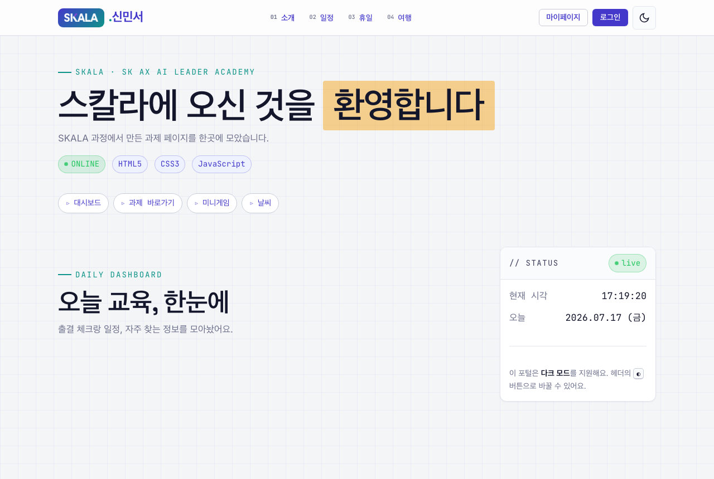
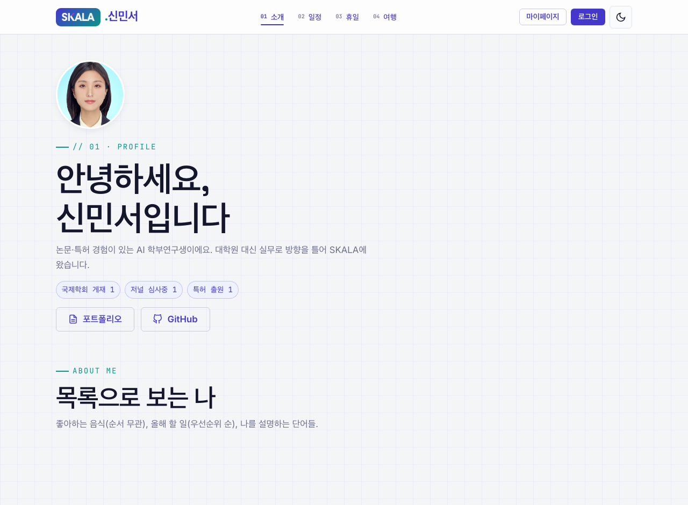
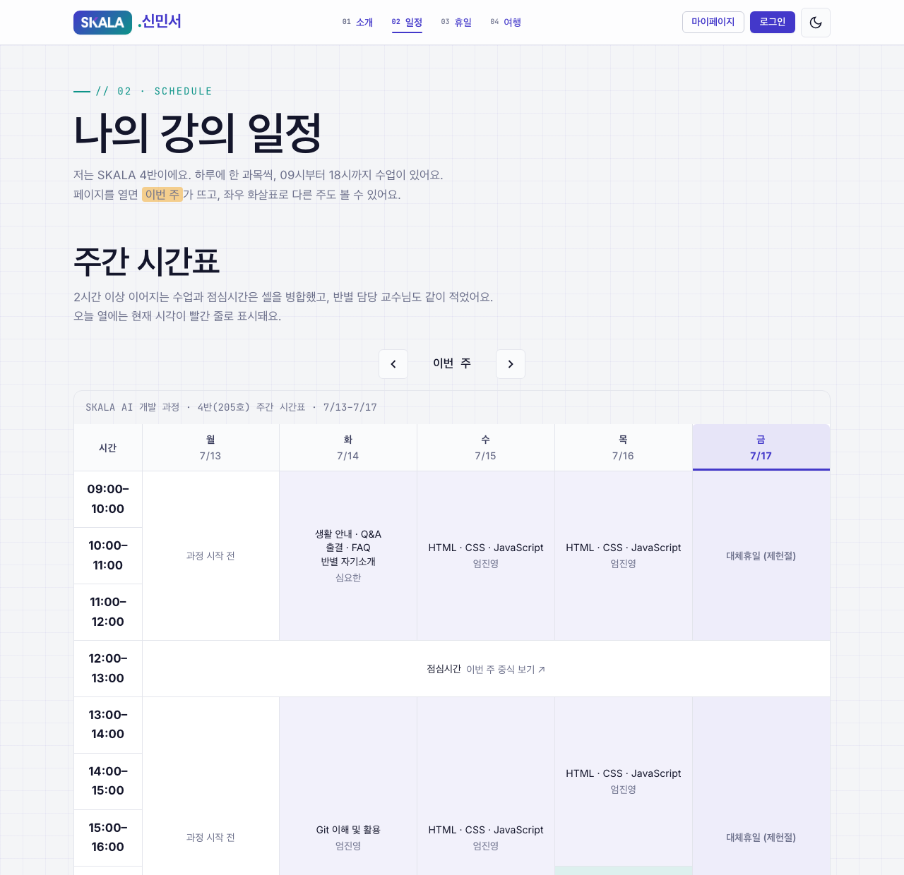
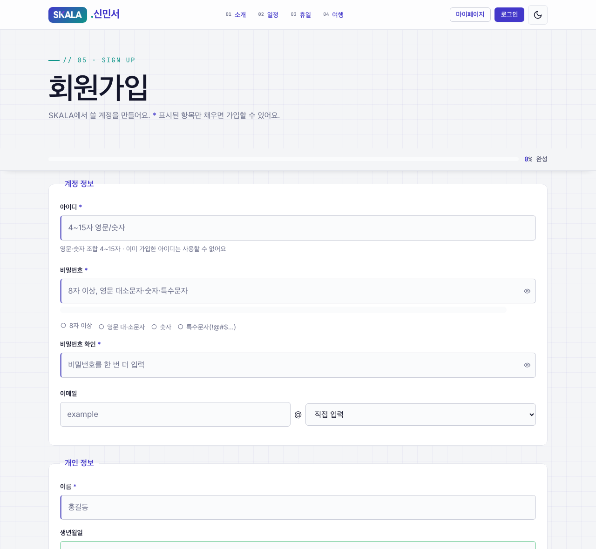
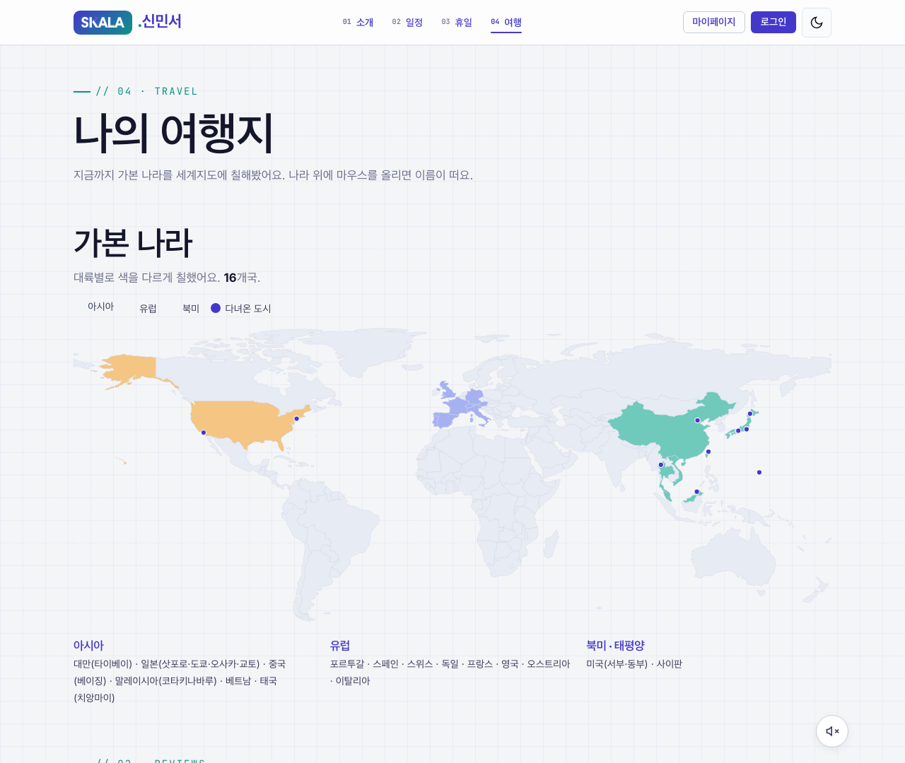
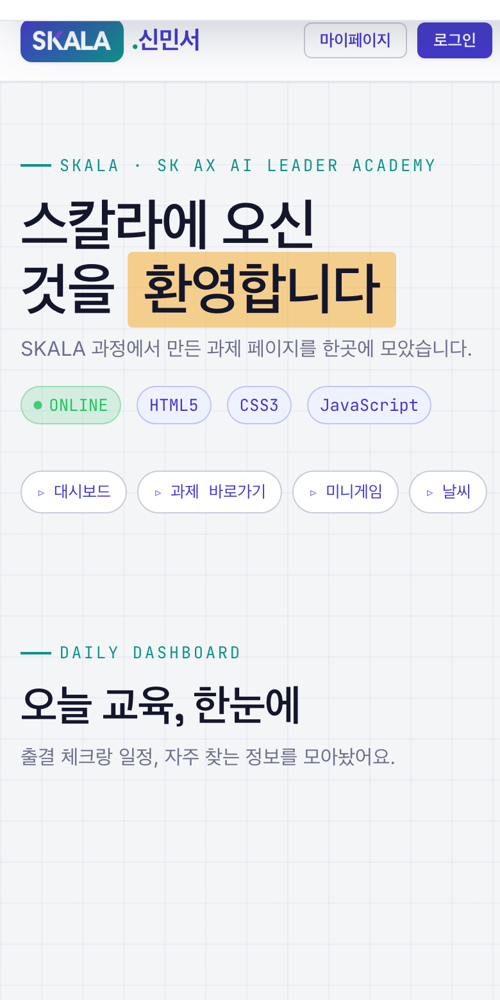
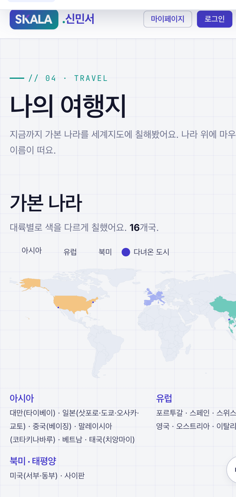
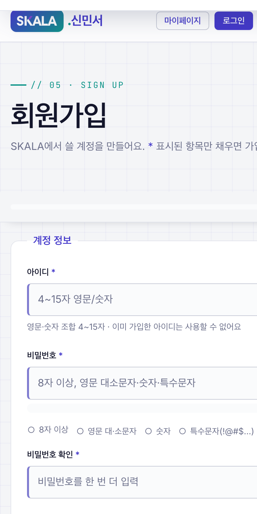

# SKALA-FRONT · 신민서

> SKALA Full-Stack 과정의 HTML · CSS · JavaScript 과제를 **하나의 개인 포털**로 묶은 프로젝트.
> 프레임워크·라이브러리 없이 순수 웹 표준만으로 만들었습니다.


---

## 🚀 직접 구현한 주요 기능

> 과제 필수 요건 위에, 완성도를 높이려고 **직접 설계해 얹은 기능들**입니다.

| 기능 | 무엇을 하나 | 핵심 기술 |
|---|---|---|
| 🦖 **공룡 달리기 게임** | 크롬 오프라인 게임 오마주 러너 (점프·선인장 회피·최고점수) | `<canvas>` · `requestAnimationFrame` 게임 루프 · AABB 충돌 · `localStorage` |
| 🌦 **실시간 날씨** | 국내외 13개 도시 선택 → 실시간 기온·습도 | `fetch` · `async/await` · **ES Module 분리** · Open-Meteo API |
| 🗺 **색칠 세계지도** | 가본 나라를 대륙별로 색칠 (지도 라이브러리 X) | GeoJSON 등거리 투영 → **인라인 SVG**(180개국) |
| 🔐 **데모 로그인 · 마이페이지** | 회원가입 계정으로 로그인/프로필 수정/탈퇴 | `localStorage` 세션 · **Web Crypto SHA-256** 해시 |
| 🎵 **여행 배경음악** | 인트로 클릭으로 자동재생, 오디오 재생 시 페이드 덕킹 | Audio API · 이벤트 · 음소거 토글 |
| 📊 **온보딩 대시보드** | 현재 상태(공휴일 인식)·D-day 진도·출결 체크·주소 복사 | DOM · **컨테이너 쿼리** · `localStorage` |
| 🔢 **미니앱 3종** | 숫자 맞히기·성적 계산기·내 가방 | `<dialog>` 리메이크 + 교재 방식(`prompt`/`alert`) 실행 경로 |

> 그 외 심화 마크업: `<meter>` 비밀번호 강도, `<details>` 아코디언, `<picture>` 반응형 이미지, `datalist`·`optgroup`·`pattern` 폼 검증 등.

---

## ▶️ 실행

루트의 `index.html`을 브라우저에서 열거나 **VS Code Live Server**로 실행합니다.
> 실시간 날씨(모듈 import)·ES Module은 `file://`에서 막히므로 로컬 서버 실행을 권장합니다.

---

## 🧩 기술 스택

| 구분 | 사용 기술 |
|---|---|
| **HTML** | 시맨틱 마크업, 폼, `<dialog>` · `<meter>` · `<details>` · `<picture>` · 인라인 SVG · `<canvas>` |
| **CSS** | 커스텀 프로퍼티(디자인 토큰), Flexbox · Grid, **컨테이너 쿼리**, `@media` 반응형, `@keyframes`·transition 애니메이션, `@import` 모듈화 |
| **JavaScript** | ES Module(`import`/`export`), `fetch` + `async/await`, **Canvas 게임 루프**(`requestAnimationFrame`), `localStorage`, Web Crypto(SHA-256), 이벤트 위임 |
| **API** | [Open-Meteo](https://open-meteo.com) (무료·키 불필요 날씨 API) |
| **폰트** | Google Fonts — Space Grotesk · Inter · JetBrains Mono |

---

## 🌐 공통 기반

- **디자인 시스템** — `:root` CSS 변수(색·타이포·간격)로 통일. `style.css`가 `@import`로 `tokens → base → layout → components → dashboard → animations → utilities` 통합
- **다크 모드** — `data-theme` + `localStorage` + OS 선호 자동 감지, FOUC 방지 인라인 스니펫
- **반응형** — 786px 이하 세로 1열 + 모바일 햄버거 네비, 대시보드는 **컨테이너 쿼리**로 실제 폭 기준 리플로우
- **접근성** — 스킵 링크, 시맨틱 랜드마크, `:focus-visible`, `aria-*`, `prefers-reduced-motion` 존중, 폼 label 연결, 색 대비 확보

---

## 📋 과제 요구사항 대비 구현

### HTML

| 과제 | 필수 요소 | 상태 |
|---|---|---|
| 포털 Hub (`index.html`) | `<nav>` `<main>` `<aside>` + 페이지 바로가기 | ✅ |
| 나의 휴일 (`myHoliday`) | `<h1>` `<h2>` `<br>` `<p>` `<mark>` | ✅ |
| 나의 소개 (`myProfile`) | `<ul>` `<ol>` `<dl>` · **파일 내 CSS 0줄** | ✅ |
| 강의 일정 (`myClass`) | `<table>`/`<thead>`/`<tbody>`/`<td>` + 셀 병합 · **CSS 0줄** | ✅ |
| 회원가입 (`signUp` → `signUpResult`) | `<form method="get">` · `<fieldset>`/`<legend>`/`<label>` · `<input>`/`<select>`/`<textarea>` · submit·reset | ✅ |
| 나의 여행지 (`myTrip`) | `<audio>` · `` · `<video>` + `trip-card` 리뷰 카드 | ✅ |

### CSS 미션

| 미션 | 내용 | 상태 |
|---|---|---|
| 1 | 전체 테마·폰트(구글폰트, body 태그 선택자), 제목·링크 스타일 | ✅ |
| 2 | 박스 모델 — `.container` 가운데 정렬, `myTrip` 리뷰 카드, `myClass` 테이블 정돈 | ✅ |
| 3 | 회원가입 폼 — 입력창·fieldset 테두리·버튼 스타일 | ✅ |
| 4 | Flex & Grid — 바로가기 Flexbox, main/aside 가로 배치, 여행 카드 3열 Grid | ✅ |
| 5 | 반응형 — 786px 이하 1열 전환 | ✅ |
| 6 | 애니메이션 — hover 전환, 카드 떠오름+그림자, 헤더 타이틀 페이드인 | ✅ |

### JavaScript

| 과제 | 요구 문법 | 상태 |
|---|---|---|
| Up-Down 게임 (`upDown.js`) | `Math.random` · 반복 · 비교 → Up/Down | ✅ |
| 성적 계산기 (`grade.js`) | `subjects` 배열 · `for` 합산 · 평균 · 합격 · 등급 | ✅ |
| 내 가방 (`bag.js`) | 객체 배열 `myBag` · `showMyBag()` 반복 출력 | ✅ |
| 실시간 날씨 (`weatherAPI.js` + `realtimeInfo.js`) | `change` 이벤트 · `fetch`/`async·await` · **ES Module 분리** | ✅ |

> **미니게임은 두 가지 경로를 제공합니다.** 기본은 완성도를 높인 `<dialog>` 모달 버전, 그리고 교재 명세 그대로의 `prompt`/`alert` 버전을 각 모달의 *"교재 방식"* 버튼으로 실제 실행할 수 있게 남겼습니다.

---

## 📸 페이지 미리보기

<table>
  <tr>
    <td width="50%" align="center">
      <b>메인 포털</b> · <code>index.html</code><br/>
      <sub>포털 허브 · 온보딩 대시보드 · 미니앱</sub><br/><br/>
      
    </td>
    <td width="50%" align="center">
      <b>나의 소개</b> · <code>myProfile.html</code><br/>
      <sub>ul/ol/dl 목록 · 아바타 · FAQ 아코디언</sub><br/><br/>
      
    </td>
  </tr>
  <tr>
    <td width="50%" align="center">
      <b>강의 일정</b> · <code>myClass.html</code><br/>
      <sub>주간 시간표 · 셀 병합 · 오늘 강조</sub><br/><br/>
      
    </td>
    <td width="50%" align="center">
      <b>회원가입</b> · <code>signUp.html</code><br/>
      <sub>fieldset · 비밀번호 강도 · GET 폼</sub><br/><br/>
      
    </td>
  </tr>
  <tr>
    <td colspan="2" align="center">
      <b>나의 여행지</b> · <code>myTrip.html</code><br/>
      <sub>가본 나라를 색칠한 인라인 SVG 세계지도</sub><br/><br/>
      
    </td>
  </tr>
</table>

> 이 외에 `myHoliday.html`(나의 휴일)·`signUpResult.html`(가입 결과)·`login.html`/`myPage.html`(로그인·마이페이지)이 있습니다.

---

## 📱 반응형 웹 디자인

> 화면 폭 **786px 이하**에서 본문·사이드바가 세로 1열로 접히고, 상단 네비는 햄버거 메뉴로 전환됩니다.

<table>
  <tr>
    <td width="33%" align="center">
      <b>메인 포털</b> <sub>(모바일)</sub><br/><br/>
      
    </td>
    <td width="33%" align="center">
      <b>나의 여행지</b> <sub>(모바일)</sub><br/><br/>
      
    </td>
    <td width="33%" align="center">
      <b>회원가입</b> <sub>(모바일)</sub><br/><br/>
      
    </td>
  </tr>
</table>

---

## 📁 과제 파일 목록

**HTML**
- `index.html` — 메인 화면 (개인 포털 허브)
- `html/myProfile.html` — 내 소개
- `html/myClass.html` — 내 강의 일정
- `html/myHoliday.html` — 나의 휴일 일과
- `html/signUp.html` — 회원가입
- `html/signUpResult.html` — 회원가입 결과
- `html/myTrip.html` — 내 여행지
- `html/login.html` · `html/myPage.html` — 로그인 / 마이페이지 *(추가)*

**JavaScript**
- `script/weatherAPI.js` — 날씨 데이터 처리 (Open-Meteo 호출, `export`)
- `script/realtimeInfo.js` — 날씨 화면 처리 (`import` 후 DOM 렌더)
- `script/upDown.js` — Up-Down 숫자 맞히기 게임
- `script/grade.js` — 성적 계산기
- `script/bag.js` — 내 가방 보기
- `script/dino.js` — 공룡 달리기 게임 *(추가)*
- `script/theme.js` · `app.js` · `auth.js` · `dashboard.js` · `schedule.js` · `signup.js` — 공통(테마·네비·인증·대시보드·시간표·폼)

---

## 🔒 보안 · 채점 안전성

- **민감 정보 미포함** — WiFi·도어락·Zoom 등은 소스에 두지 않고 권한 필요한 Slack 문서 링크로만 제공 → Public 저장소로 안전
- **fresh clone 대응** — `localStorage`는 런타임 상호작용(테마·출결·최고점수)에만 사용 → 채점자가 clone해도 빈 상태에서 정상 동작

---

## 🗂 프로젝트 구조

```
skala-front/
├─ index.html            진입점 · 개인 포털 허브
├─ html/                 과제 페이지들
│  ├─ myProfile.html  myClass.html  myHoliday.html  myTrip.html
│  ├─ signUp.html  signUpResult.html
│  └─ login.html  myPage.html
├─ css/                  style.css가 @import로 모듈 통합
│  └─ tokens · base · layout · components · dashboard · animations · utilities
├─ script/
│  ├─ theme.js  app.js  auth.js  dashboard.js  schedule.js  signup.js
│  ├─ upDown.js  grade.js  bag.js  dino.js        미니앱
│  └─ weatherAPI.js  realtimeInfo.js              실시간 날씨 (ES Module)
└─ media/                로고 · 이미지 · 영상 · 음악
```
